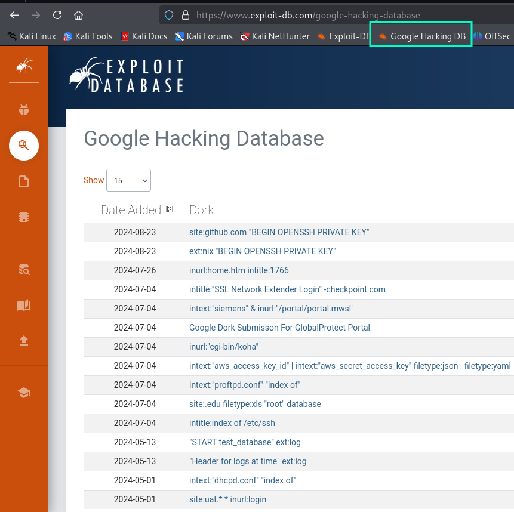
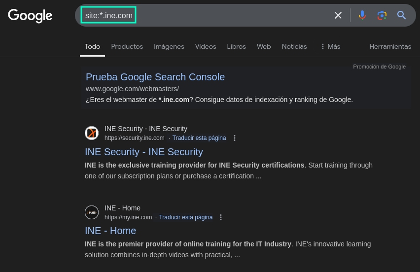
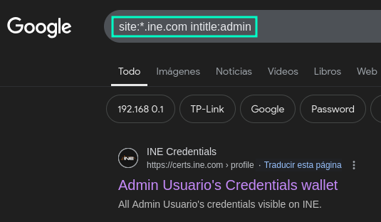
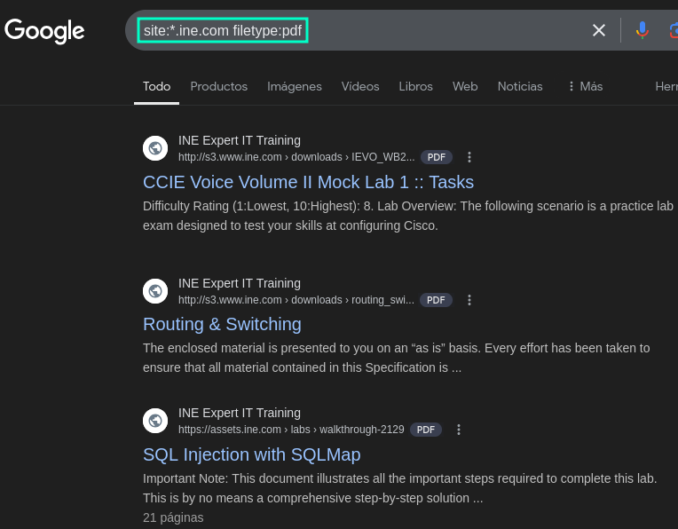
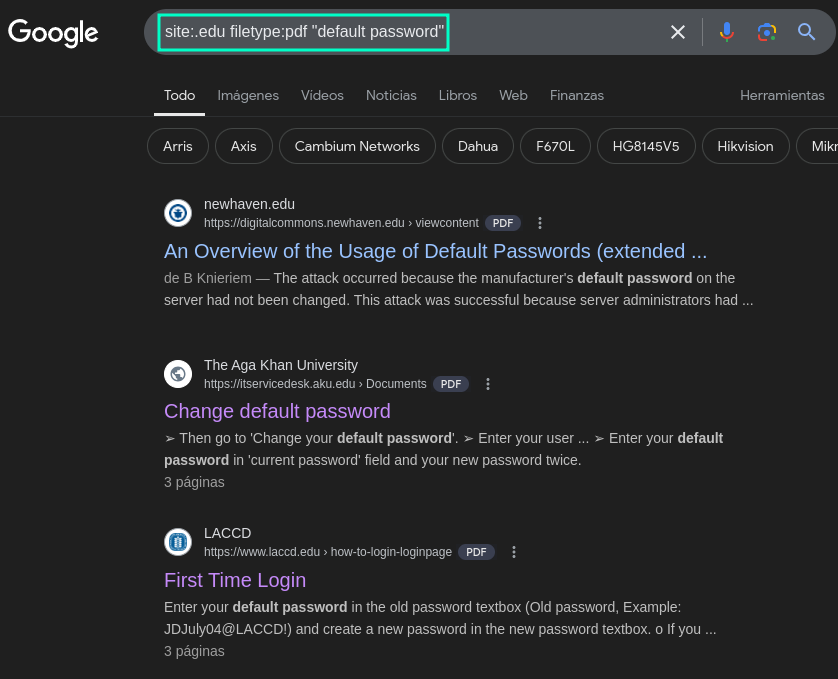
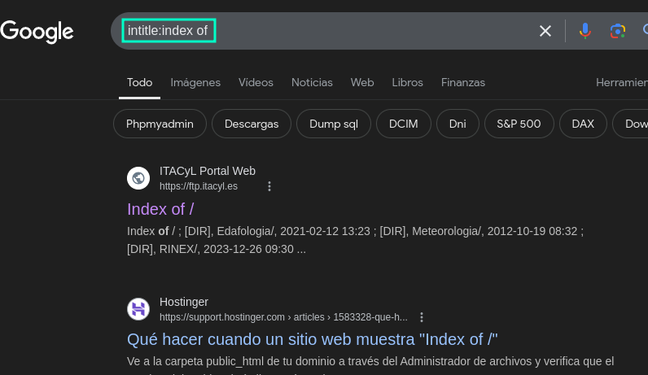
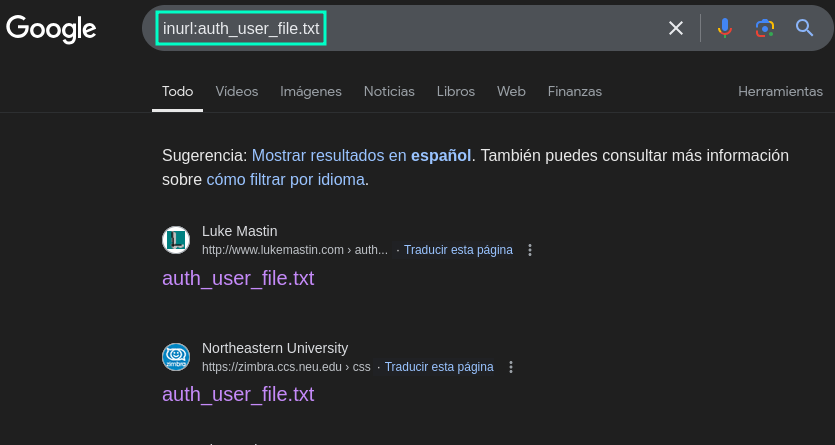
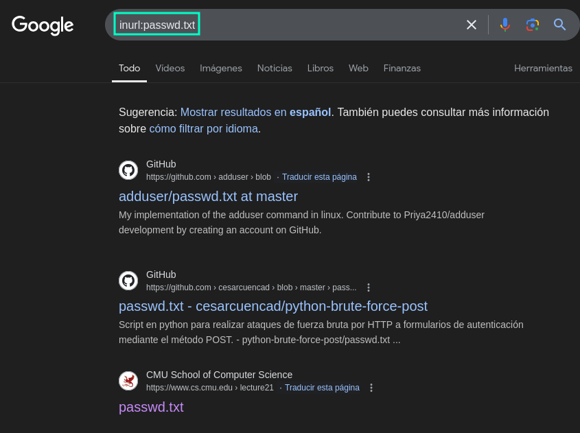

- [Introducción](#introducción)
- [Parámetros más interesantes](#parámetros-más-interesantes)
- [Exploit-db](#exploit-db)
- [Combinaciones de parámetros](#combinaciones-de-parámetros)
- [Despido 👋](#despido-)

---

## Introducción

Recientemente, aprendí esta técnica en la certi eJPTV2 y me pareció una muy buena manera de conseguir información de forma pasiva. De antes conocía **Google Dorks** pero no había probado nunca a usar esta técnica.  

Básicamente Google Dorks aprovecha el motor de búsqueda de Google para encontrar información específica que puede estar expuesta sin intención.

Desde archivos sensibles hasta configuraciones mal protegidas, el potencial es enorme si sabes cómo utilizarlo correctamente.

Lo mejor de todo es que no interactúas directamente con el servidor, lo que permite realizar búsquedas de forma discreta y sin alertar al sistema objetivo. Simplemente ten cabeza y no la lies con lo que encuentres por ahí.

---

## Parámetros más interesantes

A continuación voy a poner una tabla de mis apuntes de Obsidian en la que mostraré los parámetros más importantes a mi parecer:

| **Operador**     | **Descripción**                                                               | **Ejemplo**                     |
| ---------------- | ----------------------------------------------------------------------------- | ------------------------------- |
| `site:`          | Busca páginas dentro de un dominio específico.                                | `site:example.com`              |
| `filetype:`      | Busca archivos de un formato específico.                                      | `filetype:pdf site:example.com` |
| `intitle:`       | Encuentra páginas con palabras clave específicas en el título.                | `intitle:"login"`               |
| `allintitle:`    | Busca páginas donde todas las palabras clave estén en el título.              | `allintitle:password reset`     |
| `inurl:`         | Busca páginas con palabras clave específicas en la URL.                       | `inurl:admin`                   |
| `allinurl:`      | Encuentra páginas donde todas las palabras clave estén en la URL.             | `allinurl:login admin`          |
| `intext:`        | Busca páginas con palabras específicas dentro del contenido.                  | `intext:"error 404"`            |
| `allintext:`     | Encuentra páginas donde todas las palabras clave estén en el contenido.       | `allintext:username password`   |
| `"texto exacto"` | Busca páginas que contengan exactamente la frase dentro de las comillas.      | `"default password"`            |
| `cache:`         | Muestra la versión en caché almacenada por Google de una página.              | `cache:example.com`             |
| `link:`          | Encuentra páginas que enlacen a un dominio o URL específica.                  | `link:example.com`              |
| `related:`       | Encuentra sitios relacionados con un dominio específico.                      | `related:example.com`           |
| `define:`        | Busca la definición de una palabra o término.                                 | `define:cybersecurity`          |
| `AROUND(X)`      | Encuentra páginas donde dos términos están cerca, con X palabras entre ellos. | `password AROUND(5) admin`      |
| `*`              | Utiliza un comodín para buscar términos o frases desconocidos.                | `"error * login"`               |
| `..`             | Define un rango de números en las búsquedas.                                  | `filetype:pdf 2020..2022`       |
| `-`              | Excluye términos o dominios de la búsqueda.                                   | `site:example.com -login`       |
| `OR`             | Combina términos alternativos en una búsqueda.                                | `login OR signin`               |

## Exploit-db

También podemos echarle un ojo a Exploit-db. Es una base de datos con una amplia colección de parámetros probados por la comunidad y listos para usar. [exploit-db](https://www.exploit-db.com/google-hacking-database)

## Combinaciones de parámetros

**site:DOMAIN** -> Muestra todo el contenido del dominio especificado.

**inunrl:admin** -> Busca URLs que contengan la palabra "admin".

**site:* .DOMAIN** -> Muestra todos los subdominios del dominio especificado.

**site: * .DOMAIN intitle:admin** -> Además de filtrar todos los subdominios, muestra títulos que contengan la palabra admin.

**site: * .DOMAIN filetype:PDF** -> Además de filtrar todos los subdominios, muestra solo los archivos PDF.

**site:.edu filetype:pdf "default password"** -> Filtra por extensión .edu, busca solo archivos PDF y que en el nombre contenga "default password".

**intitle:index of** -> Muestra el listado de directorios. Esto no es una mala configuración pero puede que estén expuestos.

**cache:DOMAIN** -> Te mostrará la última snapshot que tiene el DOMINIO especificado.

**inurl:auth_user_file.txt** -> Muestra el archivo auth_user_file.txt que puede contener información sensible, comunmente asociado con configuraciones de autenticación. Servidores Apache configurados con **.htaccess**.

**inurl:passwd.txt** -> Muestra el archivo passwd.txt, podrás ver usuarios.

**inurl:wp-config.bak** -> Puede no haber eliminado el backup y el archivo de configuración contiene las credenciales de la base de datos de MySQL.

## Despido 👋

- Sé que hay muchas más combinaciones increíbles, por eso te invito a que, si conoces alguna otra, las compartas en los comentarios de LinkedIn de esta publicación. 💡
  
- Así que gracias por haber llegado hasta aquí y por supuesto espero que le haya servido de mucha ayuda.
