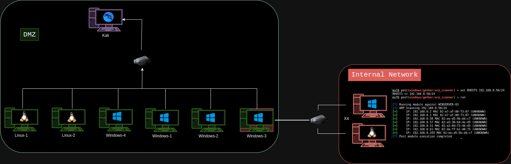

- [Introducción](#introducción)
- [Consejos para la preparación](#consejos-para-la-preparación)
- [Día del examen](#día-del-examen)
- [Herramientas necesarias](#herramientas-necesarias)
- [Despedida](#despedida)

---

## Introducción

Buenas a todos 👋, escribo este post día 15 de Diciembre de 2024, justo hoy he aprobado la **eJPTv2** de eLearnSecurity's.

Empecé a prepararme de manera autodidacta no hace ni un año ya que me empecé a interesarme por este mundillo, que fue cuando descubrí está certificación. Investigué sobre que entraba en ella, herramientas trucos, etc. A principios de verano se me metió en la cabeza que quería sacarme esta certificación y no ha sido hasta el día 22 de noviembre (Aprovechando las ofertas de Black Friday) cuando decidí comprarme el Voucher, además de que venía con la ICCA y salió todo por $199 (197€). Traía la preparación para el curso que luego voy a dar mi opinión en la siguiente sección y por supuesto tus 2 intentos al examen en un tiempo de 6 meses. Entonces desde ese día empecé a prepararme día a día con el curso respectivo además de prácticar con sus laboratorios y máquinas de plataformas como DockerLabs, TheHackerLabs, Vulnyx, Vulnhub etc. En principio no tenía pensado que me la fuera a sacar para antes de acabara el año pero la semana pasada, día 9 de Diciembre me propuse este reto (solo llevaba de la primera sección los 2 primeros cursos) y hay 4 secciones. Aún más loco decidí hacerla este fin de semana. No había tiempo físico en una semana para acabar todas las secciones, pero lo que sí había eran ganas y confianza en mí mismo. Así que me puse manos a la obra con todos los **laboratorios** y con mis **apuntes**.

## Consejos para la preparación

- El primer consejo que doy y siempre daré será que <u>realices 100% los cursos que te ofrece eLearnSecurity</u>. Ofrecen la preparación necesaria y más para enfrentarte al examen.
- <u>Coge apuntes</u>: Se que habrás leido muchas review y todas dicen lo mismo, pero es que es por algo, coge apuntes porque los vas a necesitar.
- <u>Práctica mucho</u>: Yo personalmente necesito practicar para que de verdad interiorice las técnicas y herramientas. Recomiendo todas las máquinas de nivel Fácil y Medio de DockerLabs, de Vulnyx, TheHackerLabs y de VulnHub (Symfonos, FristiLeaks, DarkHole1). No he mencionado Hack The Box porque aunque tenga máquinas gratuitas, yo personalmente no he realizado ninguna. Para la OSCP si le daré caña.
- <u>Ten una buena metodología</u>: Considero es de lo más importante, conseguir una buena metodología que te venga a tí bien, no copies la forma o la manera de hacer las cosas de una persona, intenta seguir unos pasos con los que te sientas cómodo a la hora de realizar escaneos, ataques, apuntes, etc.

## Día del examen

Pues en mi caso lo empecé realmente el día 14, sobre las 10:30 de la mañana, y empezó dándome un fallo, básicamente no me iba Guacamole, estaba nerviosito y casi que no era capaz de escribir. Y aquí doy un consejo, repetir los escaneos. Había una pregunta que me decía que cuál host tenía un puerto en específico abierto. En el primer escaneo que hice a la red no me lo reportó en ninguna lo que me pareció bastante raro. Dejé esa pregunta apartada y luego volví a hacer un escaneo a ese puerto en específico pero máquina por máquina y al final me lo reportó. También había otra pregunta que me decía que cuantos puertos TCP tenía abierto un host en específico. Pues en el primer escaneo global saqué que tenía 11 abiertos, pero en las posibles respuestas no se encontraba esa, lo que también me resultó bastante raro. Así que volví a hacer el escaneo de nuevo y ya me reportó 14. Por eso digo que es **MUY IMPORTANTE REPETIR LOS ESCANEOS**.

- Otro consejo muy importante que recomienda mucha gente y no voy a ser menos es hacerte un esquema gráfico de como está organizada la red, ya que te va a facilitar el cómo funciona. Aquí dejo un esquema de como me tocó a mí.

---

---

Básicamente tenía en la DMZ 2 máquinas Linux, entre ellas una tenía un Drupal y luego 4 Windows en la que la máquina 3 era la que tenía el pivoting. Luego en la Red Interna había 4 equipos más, 1 Linux y 3 Windows.

- Un consejo importante pero importante es descansar la mente. De verdad que es muy necesario, porque estoy 100% seguro de que si estás ofuscado con algo que no te sale y descansas un poco, luego le vas a dar otra visión y te va a salir, o por lo menos eso me pasó a mí. Llegó un momento que no me salía nada y estaba un poco cagado la verdad, pero fue tomarme un descanso (despejar la mente), comer algo y luego me salió todo a la primera.

- Algo importante a tener en cuenta es que el examen no es complicado, que quiero decir con esto, que no pienses cosas entrevesadas o cosas rebuscadas (fuera de la caja), son cosas intuitivas.

- Muchas respuestas están en las preguntas, por eso te recomiendo que lo leas detenidamente y enumeres todas las posibles contraseñas y usuarios que te vayan dando en un mismo fichero. Como ya sabrás, simula un entorno real, por lo que perfectamente un usuario puede utilizarse en una máquina, o en otra. Por eso es importante que hagas ataques con el mismo diccionario de usuario y de contraseña. Por supuesto no puede faltar el (rockyou), lo necesitarás.

- Tienes tiempo de sobra, son 48 horas, así que administralas bien, no se trata de una competición o de conseguirlo lo más rápido, por eso no corras y ve paso a paso.

- No te abrumes al principio del examen. A mí me pasó, y soy consciente de que es dificil controlarlo, al igual que los nervios. Pero al no haberme enfrentado nunca a un reto así, el ver tantas máquinas me hizo abrumarme un poco. Finalmente lo llevé bastante bien.

- Apunta todo. Todo lo que veas, creas, pienses, apúntalo porque estoy seguro de que te servirá en un futuro.

## Herramientas necesarias

Pues voy a decirte una lista de herramientas que considero que debes dominar para esta certificación:

- Reconocimiento
  -  Pasivo
     - whatweb
  - Activo
    - arp-scan
    - nmap
    - curl
    - dirb
    - nikto [No me funciona nunca :( ]
    - wfuzz
- Explotación
  - cadaver
  - davtest
  - hydra
  - crackmapexec
  - smbclient
  - smbmap
  - rpcclient
  - enum4linux
  - john (The Ripper)
  - wpscan
  - xfreerdp

---

Por supuesto tienes que dominar Metasploit, y el curso de INE te da mucho contenido sobre Metasploit, incluyendo módulos, etc.

Muy importante conocer comandos cuando consigues la meterpreter, por ejemplo para conseguir persistencia (pgrep explorer y migrate). Todo esto se ve en el curso muy detallado.

## Despedida

En resumen y bajo mi opinión, recomiendo al 200 por 100 esta certificación, no solo porque te abre las puertas en este mundo, sino porque también te da una primera toma de contacto frente a este tipo de exámenes, por eso lo recomiendo muchísimo.

Me ha encantado esta certificación y dicho todo esto.

Road to OSCP+...